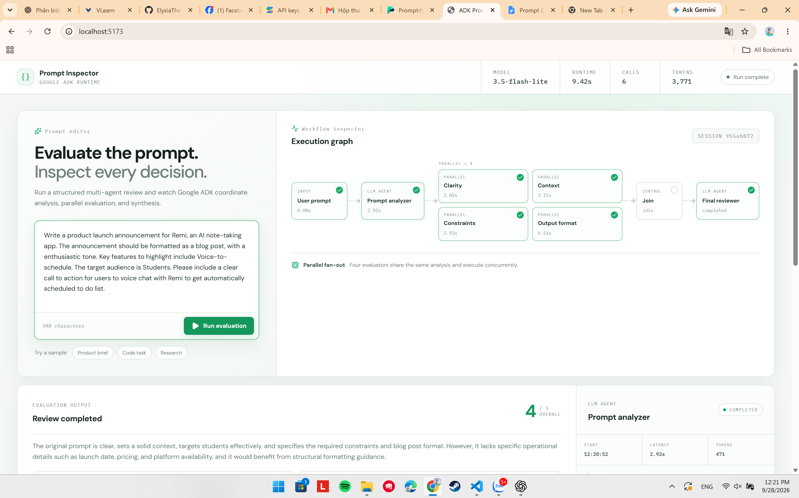

# Google ADK Prompt Improver

Demo trực quan giúp tìm hiểu cách **Google Agent Development Kit (ADK)** điều phối nhiều AI Agent (fan-out / fan-in workflow, custom search tool, và browser automation tool) để **phân tích, bổ sung ngữ cảnh, chấm điểm, cải thiện và kiểm thử chéo (validate)** một prompt.



---

## Kiến trúc tổng thể (3 Giai đoạn)

Hệ thống giữ nguyên một **core evaluation workflow** rõ ràng và tách biệt hai capability tùy chọn bên ngoài để người dùng chủ động kích hoạt khi cần:

```text
                    ┌─ 1. Enrich Context ───────► context_enrichment_agent ──► search_web (Wikipedia + DuckDuckGo)
                    │
User Prompt ────────┼─ 2. Run Evaluation ───────► ADK Graph Workflow (Analyzer -> 4 Evaluators -> Join -> Final Reviewer)
                    │
                    └─ 3. Validate Result ──────► promptify_validator_agent ─► validate_with_promptify (Playwright)
```

### Giai đoạn 1: Core Evaluation Workflow (Fan-out / Fan-in)

```text
User Prompt
    |
    v
Prompt Analyzer
    |
    +--------------+---------------+----------------+----------------+
    |              |               |                |                | (tùy chọn)
    v              v               v                v                v
 Clarity        Context        Constraints      Output Format    Context Enricher
 Evaluator      Evaluator      Evaluator        Evaluator        (search_public_context)
    |              |               |                |                |
    +--------------+---------------+----------------+----------------+
                                   |
                                   v
                                  Join
                                   |
                                   v
                            Final Reviewer
                                   |
                                   v
                       Scores + Improved Prompt
```

- **Bốn Evaluator chạy song song**: Thời gian chạy của cả cụm xấp xỉ với evaluator chậm nhất chứ không phải tổng thời gian của 4 agent.
- **Ổn định điểm số (Scoring Consistency)**:
  - Thanh trượt `Temperature` từ `0.0` đến `1.0` (mặc định `0.0` để giảm dao động tối đa).
  - Rubric chấm điểm chuẩn hóa từ `1` đến `5` cho cả 4 tiêu chí (`Clarity`, `Context`, `Constraints`, `Output Format`).
  - `overall_score` luôn được Python tính trung bình cộng chính xác từ 4 điểm thành phần, không để LLM tự ước lượng.

### Giai đoạn 2: Context Enrichment (Web Search Tool)

- Nút **Enrich context** ngay cạnh **Run evaluation** gọi `context_enrichment_agent` kèm custom tool `search_web(query)` (kết hợp Wikipedia REST API và DuckDuckGo).
- Trả về:
  - `missing_context`: những thông tin còn thiếu trong prompt gốc.
  - `search_query`: câu truy vấn agent đã dùng.
  - `suggested_context`: danh sách các ý ngữ cảnh gợi ý kèm checkbox.
  - `sources`: nguồn trích dẫn có tiêu đề và link cụ thể.
- **Human-in-the-loop**: Không tự ý sửa prompt của người dùng — người dùng tự chọn các ý muốn lấy và bấm **Apply context** để ghép vào trình soạn thảo.

### Giai đoạn 3: External Validation với Promptify (Browser Automation Tool)

- Sau khi có `improved_prompt`, khu vực **External Validation** cho phép chọn chủ đề bài thực hành (Lab 1–5) và bấm **Validate with Promptify**.
- `promptify_validator_agent` gọi tool `validate_with_promptify(prompt, topic)` điều khiển trình duyệt Chromium thông qua **Playwright**:
  - Lưu session đăng nhập trong thư mục `.promptify_browser_profile/` để không phải đăng nhập lại mỗi lần chạy.
  - Nếu chưa đăng nhập Google trên [Promptify](https://promptify-wheat-seven.vercel.app/), trình duyệt tự mở màn hình đăng nhập và đợi người dùng xác nhận tài khoản Google (tối đa 90 giây), sau đó **tự động đi tiếp** ngay trong lượt chạy đó.
  - Tự động điều hướng qua các màn hình của Promptify (**Chọn lớp học** $\rightarrow$ **Lộ trình học** $\rightarrow$ **Màn hình bài thực hành**), bỏ qua popup hướng dẫn, chọn đúng bài Lab, điền `improved_prompt`, bấm **Chấm điểm Prompt** và trích xuất điểm số (`/100`) cùng nhận xét chi tiết về lại giao diện UI.

### Tự động Fallback sang OpenAI khi Gemini quá tải

- Nếu Google Gemini trả lỗi `503 UNAVAILABLE` (high demand), `429 RESOURCE_EXHAUSTED` (rate limit), hoặc treo quá `ADK_EVENT_TIMEOUT_SECONDS`, backend sẽ tự động chuyển toàn bộ lượt chạy sang OpenAI (`OPENAI_MODEL`) qua LiteLLM nếu bạn đã cấu hình `OPENAI_API_KEY`.

---

## Thành phần ADK được sử dụng

| Thành phần | Vai trò trong dự án |
| --- | --- |
| `LlmAgent` | Định nghĩa `prompt_analyzer`, 4 evaluator, `final_reviewer`, `context_enrichment_agent`, và `promptify_validator_agent` |
| `Workflow` | Khai báo đồ thị thực thi fan-out (rẽ nhánh song song) và fan-in (gộp nhánh) |
| `JoinNode` | Đợi tất cả các nhánh song song hoàn tất trước khi gọi `final_reviewer` |
| `Runner` | Thực thi agent/workflow và phát luồng sự kiện (`Event`) theo thời gian thực |
| `Session` | Lưu trữ trạng thái (`session.state`) xuyên suốt một lần chạy |
| `output_key` | Tự động ghi kết quả structured output của agent vào `session.state` cho bước sau đọc |
| `output_schema` | Ép đầu ra của từng agent tuân thủ chặt chẽ Pydantic schema |
| Custom Tools | Các hàm Python (`search_web`, `search_public_context`, `validate_with_promptify`) được ADK tự động đọc chữ ký và docstring để LLM gọi |

---

## Cấu trúc thư mục

```text
.
|-- prompt_improver/
|   |-- agent.py          # Định nghĩa các LlmAgent và ADK Graph Workflow
|   |-- schemas.py        # Pydantic schemas (PromptAnalysis, FinalResult, ContextEnrichmentResult, ExternalValidationResult...)
|   |-- tools.py          # Custom tools: search_web, search_public_context, validate_with_promptify (Playwright)
|   |-- cli.py            # Chạy thử workflow trực tiếp bằng dòng lệnh (CLI)
|   `-- callbacks.py      # Telemetry callbacks theo dõi quá trình chạy
|-- frontend/
|   |-- src/App.tsx       # Giao diện React + SSE streaming state
|   |-- src/styles.css    # Giao diện trực quan (Workflow Graph, Inspector, Trace Console)
|   `-- package.json      # Cấu hình dependencies frontend (Vite + React + TypeScript)
|-- ui_backend.py         # FastAPI server + SSE streaming cho Evaluate, Enrich, và Validate
|-- requirements-ui.txt   # Các thư viện bổ sung cho UI backend, LiteLLM và Playwright
|-- tests/                # Bộ unit tests kiểm tra schemas, tools và workflow
|-- pyproject.toml        # Cấu hình package Python gốc
`-- .env.example          # File mẫu cấu hình biến môi trường
```

---

## Hướng dẫn cài đặt và chạy dự án (Từ A-Z)

### Yêu cầu hệ thống

- **Python 3.11+**
- **Node.js 20+**
- **Google Gemini API Key** (lấy miễn phí tại [Google AI Studio](https://aistudio.google.com/))
- **OpenAI API Key** *(tùy chọn, khuyên dùng để tự động dự phòng khi server Gemini bị quá tải 503)*

### Bước 1: Clone repo và cài đặt môi trường Python

Mở **PowerShell** tại thư mục bạn muốn lưu dự án:

```powershell
git clone https://github.com/ElysiaTheElysier/Google_ADK_Demos.git
cd Google_ADK_Demos

# Tạo môi trường ảo (virtual environment)
python -m venv .venv

# Kích hoạt môi trường ảo
# (Nếu PowerShell báo lỗi chặn script, chạy lệnh dưới trước):
Set-ExecutionPolicy -Scope Process -ExecutionPolicy Bypass
.\.venv\Scripts\Activate.ps1

# Cài đặt các thư viện Python và trình duyệt Chromium cho Playwright
python -m pip install --upgrade pip
python -m pip install -e ".[dev]"
python -m pip install -r requirements-ui.txt
playwright install chromium
```

### Bước 2: Cấu hình file `.env`

Tạo file `.env` từ file mẫu `.env.example`:

```powershell
Copy-Item .env.example .env
```

Mở file `.env` và điền API key của bạn:

```env
# Bắt buộc: Google AI Studio API Key
GOOGLE_API_KEY=your-google-api-key
GOOGLE_GENAI_USE_VERTEXAI=FALSE
ADK_MODEL=gemini-3.5-flash-lite

# Tùy chọn: Tự động chuyển sang OpenAI khi Gemini bị quá tải (503/429) hoặc timeout
OPENAI_API_KEY=your-openai-api-key
OPENAI_MODEL=openai/gpt-4.1-mini
ADK_EVENT_TIMEOUT_SECONDS=60

# URL ứng dụng Promptify cho tính năng Validate ở Giai đoạn 3
PROMPTIFY_URL=https://promptify-wheat-seven.vercel.app/
```

### Bước 3: Cài đặt thư viện cho Frontend

```powershell
cd frontend
npm install
cd ..
```

### Bước 4: Khởi chạy hệ thống (Backend + Frontend)

Bạn mở **2 cửa sổ terminal PowerShell** song song:

**Terminal 1 — Chạy Backend (cổng `8000`):**

```powershell
$env:PYTHONIOENCODING="utf-8"
.\.venv\Scripts\uvicorn.exe ui_backend:app --reload --host 127.0.0.1 --port 8000
```

*(Kiểm tra nhanh tại `http://localhost:8000/api/health` sẽ thấy `{"status":"ok"}`)*

**Terminal 2 — Chạy Frontend (cổng `5173`):**

```powershell
cd frontend
npm run dev
```

Sau đó mở trình duyệt tại địa chỉ: **[http://localhost:5173](http://localhost:5173)**

---

## Cách sử dụng nhanh trên giao diện Web

1. **Bước 1 — Nhập & Làm giàu ngữ cảnh (Build Prompt)**:
   - Nhập một câu prompt bất kỳ (hoặc chọn các nút **Sample** có sẵn).
   - Bấm **Enrich context** để Agent tự tìm thông tin thực tế trên Wikipedia/Web. Tích chọn các ý bạn muốn thêm rồi bấm **Apply context**.
2. **Bước 2 — Đánh giá & Cải thiện (Evaluate Prompt)**:
   - Chọn mức `Temperature` (nên để `0.0` để điểm ổn định nhất) và bấm **Run evaluation**.
   - Quan sát đồ thị **Workflow Inspector** sáng đèn theo thời gian thực. Bấm vào từng node để xem Input/Output JSON, thời gian chạy và lượng token tiêu thụ.
   - Xem điểm tổng kết và bản **Improved Prompt** ở khung kết quả.
3. **Bước 3 — Kiểm thử chéo với Promptify (External Validation)**:
   - Sau khi đã có **Improved Prompt**, kéo xuống mục **External Validation**, chọn bài Lab tương ứng và bấm **Validate with Promptify**.
   - Lần đầu tiên chạy, một cửa sổ Chromium sẽ bật lên: bạn chỉ cần đăng nhập tài khoản Google trên trang Promptify. Ngay sau khi đăng nhập xong, Agent sẽ tự động vào lớp học, mở bài thực hành, dán prompt đã cải thiện, bấm chấm điểm và mang kết quả điểm (`/100`) + nhận xét về lại trang web của bạn.

---

## Chạy thử bằng CLI hoặc chạy Kiểm thử (Unit Tests)

Chạy đánh giá nhanh qua dòng lệnh (không cần bật UI):

```powershell
$env:PYTHONIOENCODING="utf-8"
.\.venv\Scripts\python.exe -m prompt_improver "Giải thích Google ADK cho một lập trình viên mới"
```

Chạy bộ kiểm thử tự động (`pytest`) và kiểm tra code style (`ruff`):

```powershell
$env:PYTHONIOENCODING="utf-8"
.\.venv\Scripts\ruff.exe check .
.\.venv\Scripts\pytest.exe -q
```

---

## Xử lý sự cố thường gặp (Troubleshooting)

- **Lỗi `503 UNAVAILABLE (currently experiencing high demand)` từ Google Gemini**:
  - Đây là lỗi phía máy chủ miễn phí của Google khi có nhiều người truy cập cùng lúc. Bạn chỉ cần điền thêm `OPENAI_API_KEY` vào file `.env`, hệ thống sẽ tự động chuyển sang OpenAI ngay lập tức mà không làm gián đoạn quá trình chạy.
- **Lỡ tay đóng cửa sổ trình duyệt Promptify khi đang chạy**:
  - Không sao cả! Hệ thống tự động phát hiện cửa sổ đã đóng, dọn dẹp khóa profile (`SingletonLock`) và mở lại cửa sổ mới ở lần bấm **Validate with Promptify** tiếp theo.
- **Giao diện không cập nhật sau khi sửa code**:
  - Nhấn tổ hợp phím `Ctrl + Shift + R` trên trình duyệt để xóa cache cũ.

---

## Tài liệu tham khảo

- [Google ADK Documentation](https://adk.dev/)
- [ADK Graph Workflows](https://adk.dev/graphs/)
- [ADK Runtime & Runner](https://adk.dev/runtime/)
- [ADK Sessions & State](https://adk.dev/sessions/)
- [ADK LiteLLM Connector](https://adk.dev/agents/models/litellm/)
